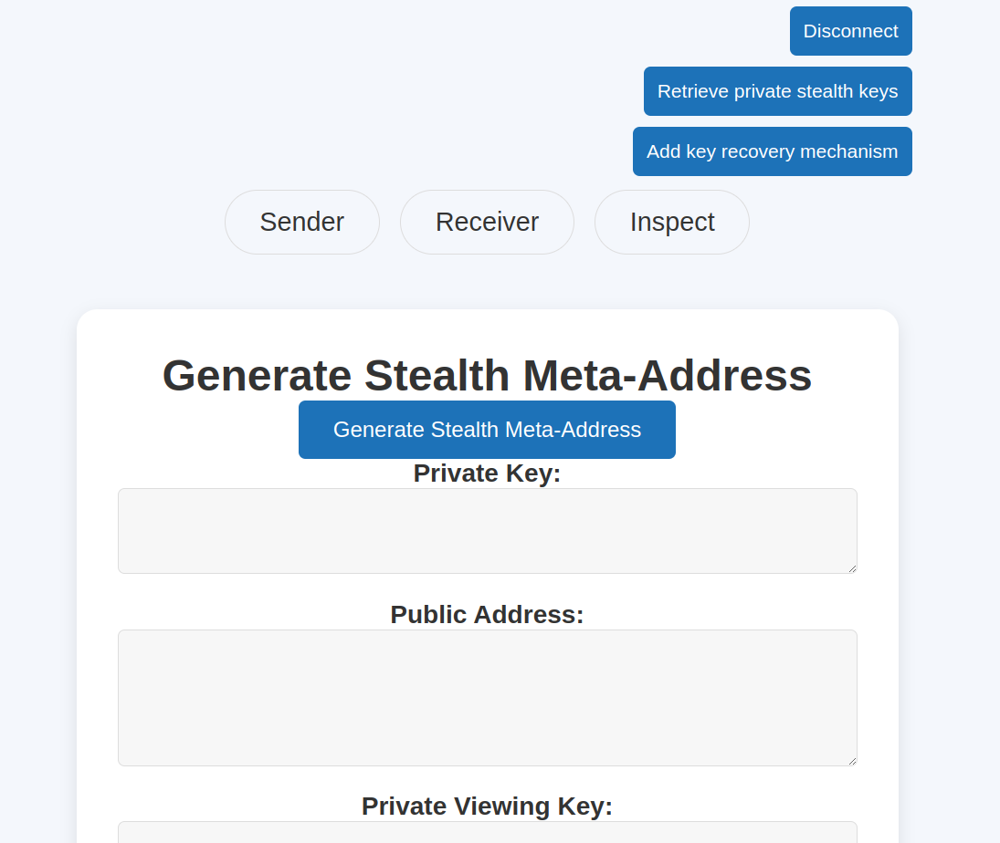
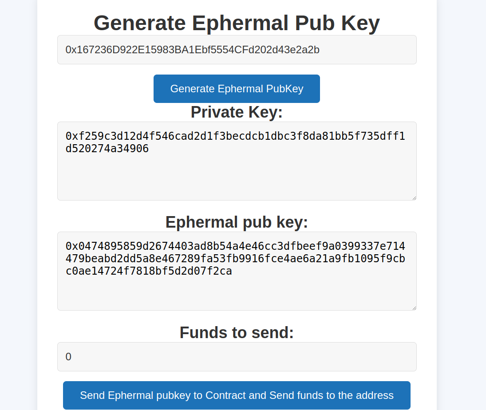
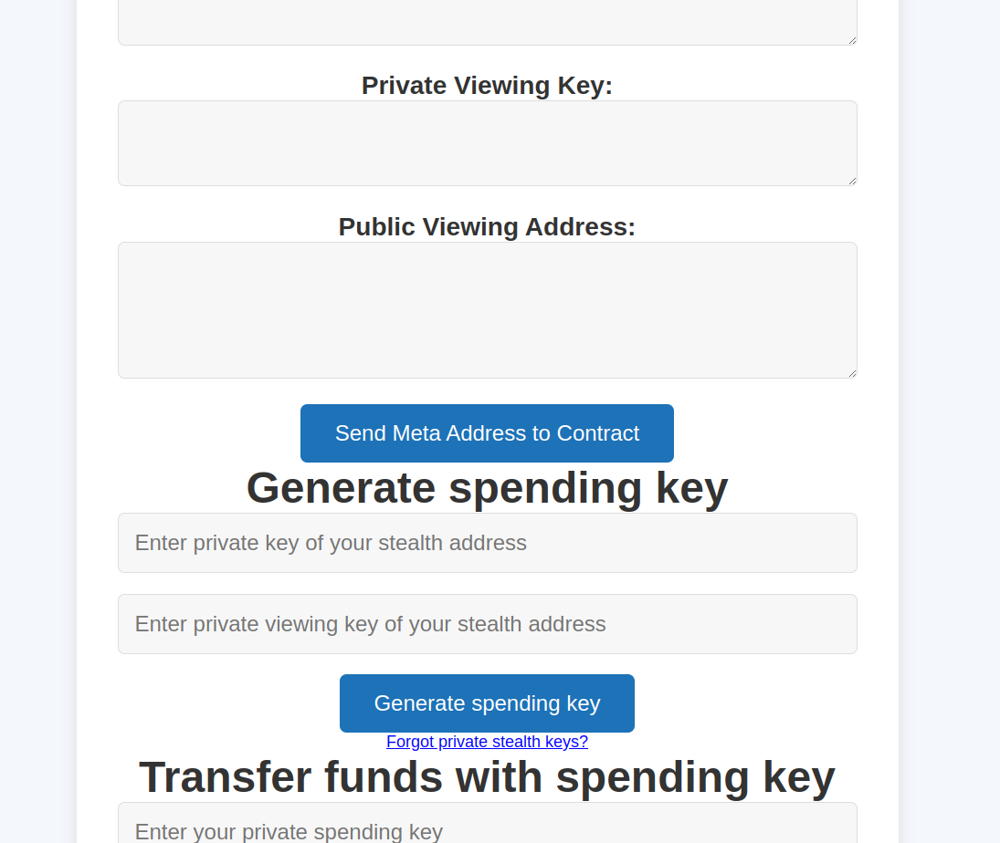
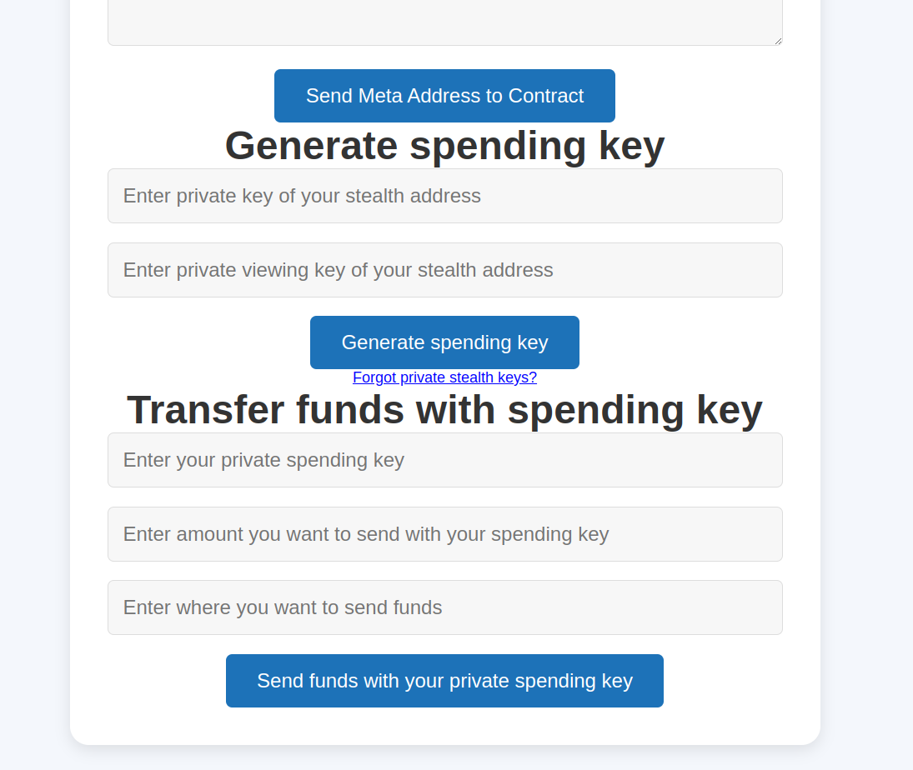

# Project Name

DKSAP (Dual Key Stealth Address Protocol)

## GitHub handle
- mmacura9
- miloje98

## Email
- marko.macura9@gmail.com 
- joksimovic21@gmail.com

## Project summary

We already implemented a prototype of this on Ethereeum and we would like to implement it here as well. Details and explanations are [here](https://github.com/mmacura9/dksap). Here are images of the current state of the flow:

### Goals and deliverables

Goals of our project is enabling DKSAP protocol and enhancing privacy of transactions to users.

### Impact on gno.land’s developer ecosystem

Adding new protocol which can be built upon with technology developments.

### Timeline and milestones

- Enhancing UI/UX (2-3 weeks)
- Rewriting code for GNO environment (3-4 weeks)
- Setting up proper backend environment to handle the whole system (3-4 weeks)
- Adding unit tests (1 week)

## Contributions or related work for gno.land (if applicable)

N.A.

## Why are you and your team well-suited for this project?

We are relatively new in crypto world, but extremely enthusiastic. We have just finished Zero Knowledge Proof course which introduced us to many concepts in crypto world. With Software Engineering backround in one of top techno companies in the world and passiong of learning and building crypto we believe we could help improve GNO. Prototyping it for the Etheereum also gives us an experience where the bottlenecks could lie. 

## Referrals or examples of past work

